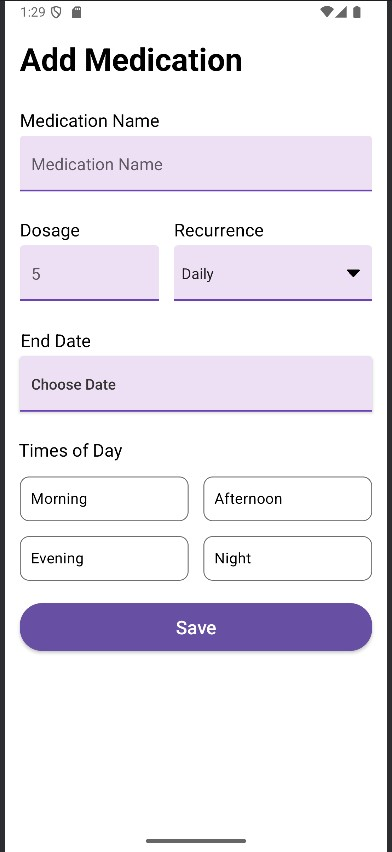

This task focuses on converting an Android UI layout built using XML into Jetpack Compose, Android’s modern declarative UI toolkit. The goal is to replicate the design and behavior of custom input fields—such as underlined EditText, styled Spinner, and date pickers—using Compose components like TextField, DropdownMenu, and custom composables, while maintaining consistent styling, spacing, and interactivity.

<video width="600" controls>
  <source src="MyAPP - Made with Clipchamp.mp4">
  Your browser does not support the video tag.
</video>

